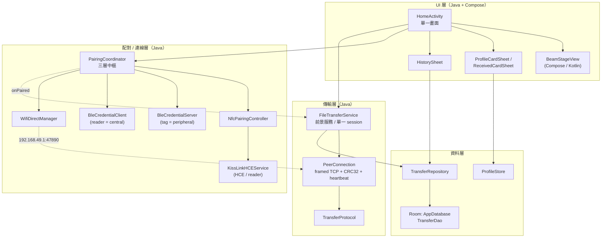
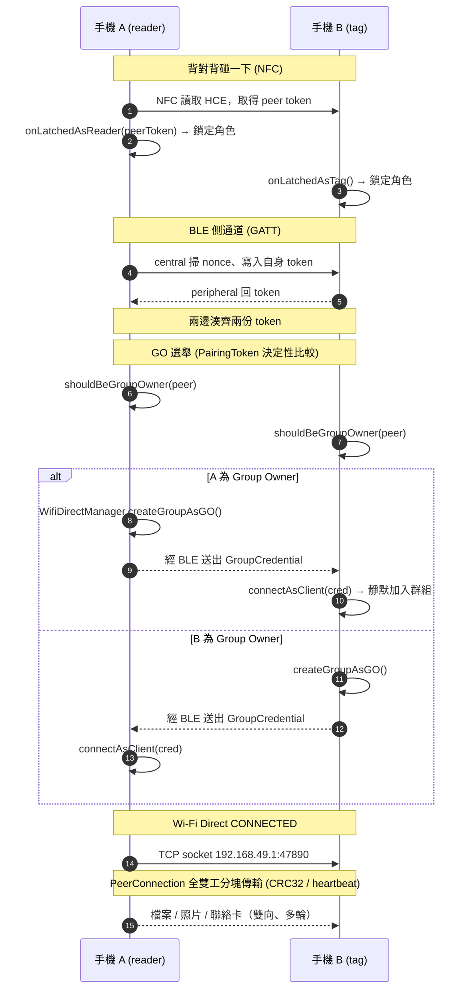
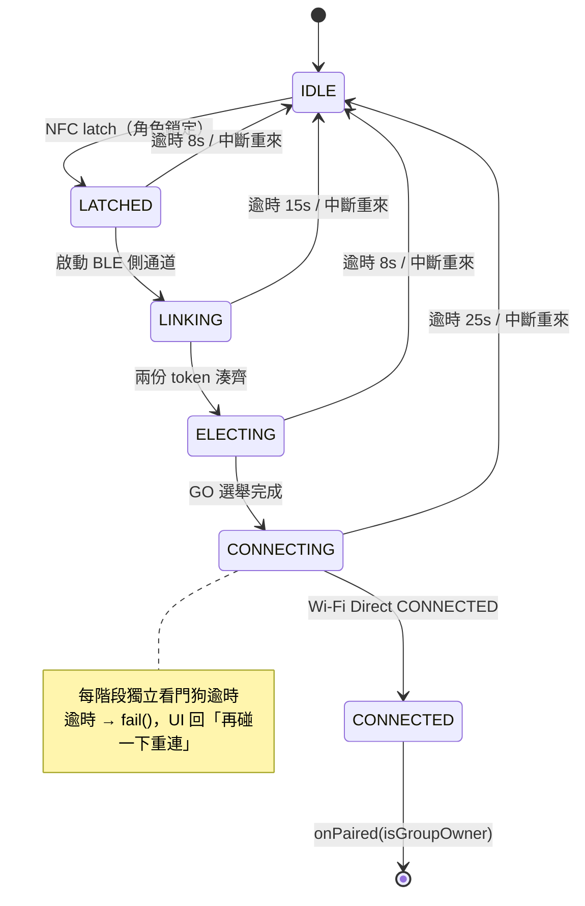

# KissLink 架構圖（Mermaid）

> 三層交握：**NFC** 碰一下啟動配對 → **BLE** 側通道交換憑證 → **Wi-Fi Direct** 群組承載高速 TCP 傳輸。

---

## 1. 系統分層架構

```mermaid
graph TD
    subgraph UI["UI 層（Java + Compose）"]
        Home["HomeActivity<br/>單一畫面"]
        Beam["BeamStageView<br/>(Compose / Kotlin)"]
        Profile["ProfileCardSheet /<br/>ReceivedCardSheet"]
        History["HistorySheet"]
        Home --> Beam
        Home --> Profile
        Home --> History
    end

    subgraph Pair["配對 / 連線層（Java）"]
        Coord["PairingCoordinator<br/>三層中樞"]
        NfcCtl["NfcPairingController"]
        HCE["KissLinkHCEService<br/>(HCE / reader)"]
        BleS["BleCredentialServer<br/>(tag = peripheral)"]
        BleC["BleCredentialClient<br/>(reader = central)"]
        Wifi["WifiDirectManager"]
        Coord --> NfcCtl
        NfcCtl --> HCE
        Coord --> BleS
        Coord --> BleC
        Coord --> Wifi
    end

    subgraph Xfer["傳輸層（Java）"]
        FTS["FileTransferService<br/>前景服務 / 單一 session"]
        Peer["PeerConnection<br/>framed TCP + CRC32 + heartbeat"]
        Proto["TransferProtocol"]
        FTS --> Peer
        Peer --> Proto
    end

    subgraph Data["資料層"]
        Repo["TransferRepository"]
        DB["Room: AppDatabase<br/>TransferDao"]
        Store["ProfileStore"]
        Repo --> DB
    end

    Home --> Coord
    Coord -. onPaired .-> FTS
    Home --> FTS
    FTS --> Repo
    Profile --> Store
    History --> Repo

    Wifi -. "192.168.49.1:47890" .-> Peer
```

---

## 2. 配對 → 連線時序

```mermaid
sequenceDiagram
    autonumber
    participant A as 手機 A (reader)
    participant B as 手機 B (tag)

    Note over A,B: 背對背碰一下 (NFC)
    A->>B: NFC 讀取 HCE，取得 peer token
    A->>A: onLatchedAsReader(peerToken) → 鎖定角色
    B->>B: onLatchedAsTag() → 鎖定角色

    Note over A,B: BLE 側通道 (GATT)
    A->>B: central 掃 nonce、寫入自身 token
    B-->>A: peripheral 回 token
    Note over A,B: 兩邊湊齊兩份 token

    Note over A,B: GO 選舉 (PairingToken 決定性比較)
    A->>A: shouldBeGroupOwner(peer)
    B->>B: shouldBeGroupOwner(peer)

    alt A 為 Group Owner
        A->>A: WifiDirectManager.createGroupAsGO()
        A-->>B: 經 BLE 送出 GroupCredential
        B->>B: connectAsClient(cred) → 靜默加入群組
    else B 為 Group Owner
        B->>B: createGroupAsGO()
        B-->>A: 經 BLE 送出 GroupCredential
        A->>A: connectAsClient(cred)
    end

    Note over A,B: Wi-Fi Direct CONNECTED
    A->>B: TCP socket 192.168.49.1:47890
    Note over A,B: PeerConnection 全雙工分塊傳輸 (CRC32 / heartbeat)
    A-->>B: 檔案 / 照片 / 聯絡卡（雙向、多輪）
```

---

## 3. PairingCoordinator 狀態機

```mermaid
stateDiagram-v2
    [*] --> IDLE
    IDLE --> LATCHED: NFC latch（角色鎖定）
    LATCHED --> LINKING: 啟動 BLE 側通道
    LINKING --> ELECTING: 兩份 token 湊齊
    ELECTING --> CONNECTING: GO 選舉完成
    CONNECTING --> CONNECTED: Wi-Fi Direct CONNECTED

    CONNECTED --> [*]: onPaired(isGroupOwner)

    LATCHED --> IDLE: 逾時 8s / 中斷重來
    LINKING --> IDLE: 逾時 15s / 中斷重來
    ELECTING --> IDLE: 逾時 8s / 中斷重來
    CONNECTING --> IDLE: 逾時 25s / 中斷重來

    note right of CONNECTING
        每階段獨立看門狗逾時
        逾時 → fail()，UI 回「再碰一下重連」
    end note
```
